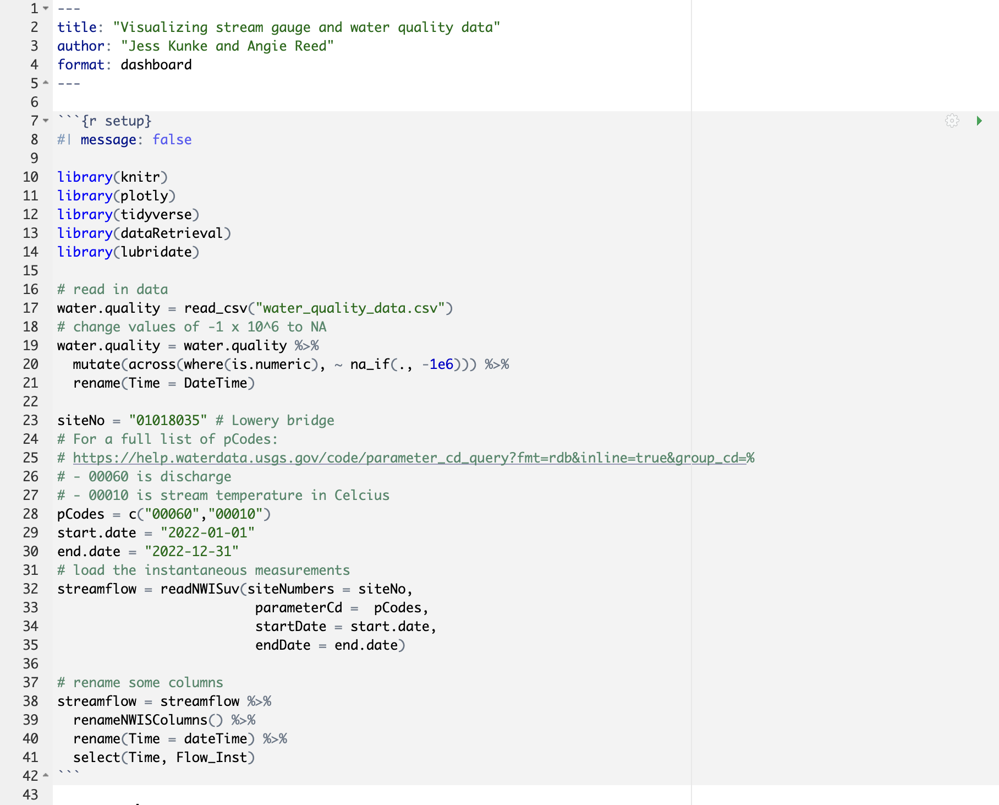
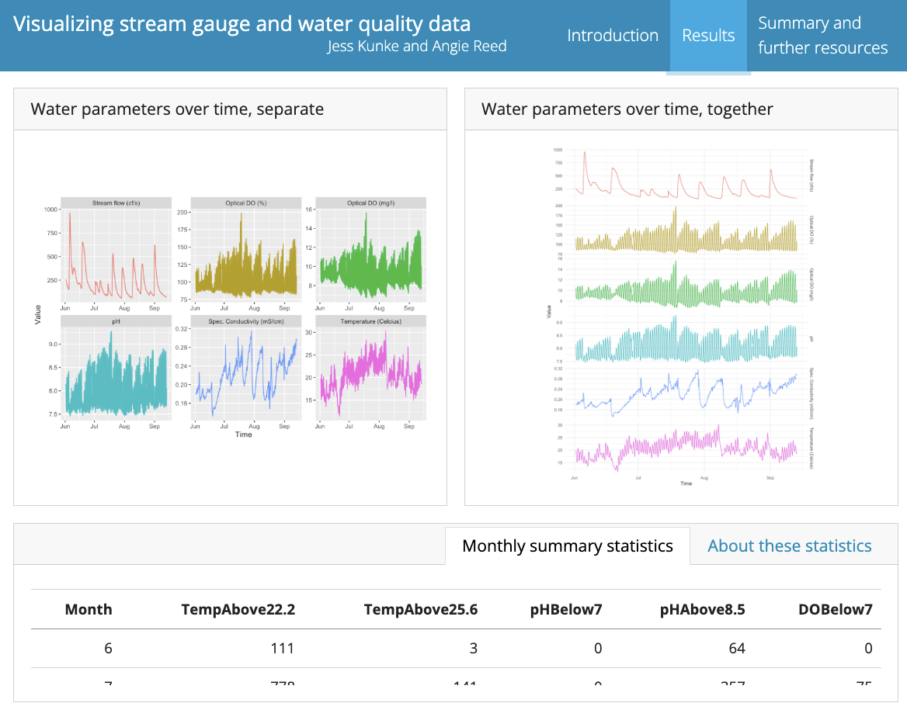
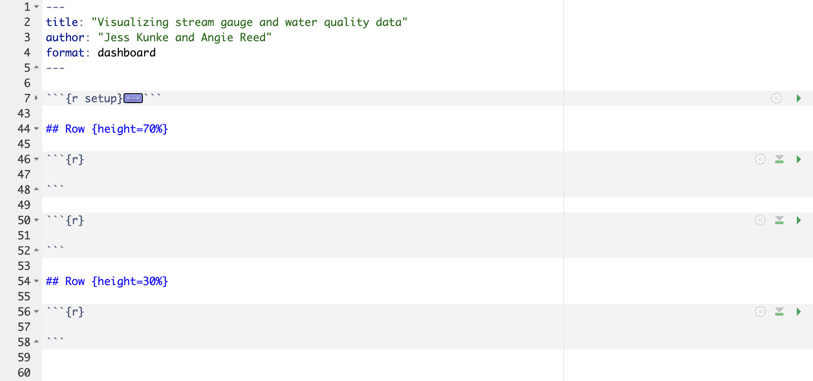
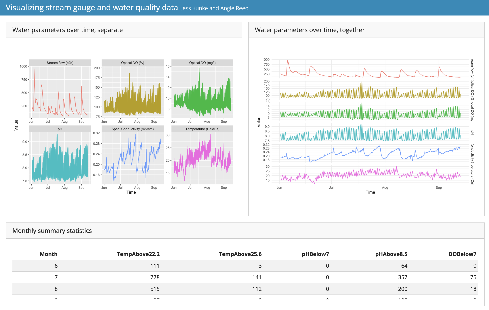
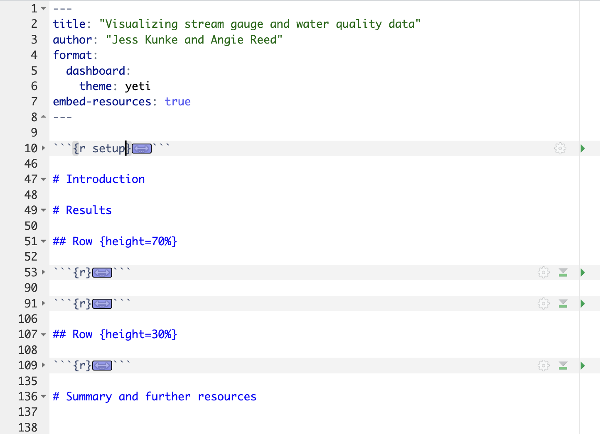
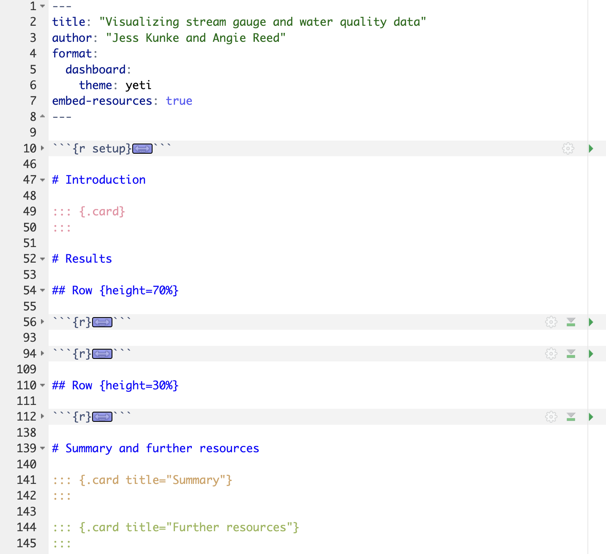

# Making a Quarto dashboard

This demo shows how to adapt a script (`01_water_quality_viz.R`) into a Quarto dashboard (`index.qmd`).

- A simpler version of the dashboard, `02_initial_dashboard.qmd`, is included to demonstrate how one might start turning the script into a dashboard, while `index.qmd` is the result of more modifications and additions.
- The Quarto dashboard file is called `index.qmd` so that the rendered document is `index.html`, which GitHub Pages will use to make a webpage. More details below.

This demo is based on the Quarto documentation for [dashboard layout](https://quarto.org/docs/dashboards/layout.html).

# Table of Contents
* [The initial script](#script)
* [The first steps to turning this script into a dashboard](#first-steps)
* [Making the script into the final dashboard](#final-dash)

<a name="script"/>

## The initial script

To start, look at the initial script, `01_water_quality_viz.R`.

- First, the script reads in a comma-separated values (csv) file of water quality data, reads in stream gauge data from USGS using the `dataRetrieval` package, and renames the variables.
- After that, the script is broken into three sections with section headings:
    - monthly summary statistics (Table)
        - compute some summary statistics about when temperature, dissolved oxygen (DO) and pH exceed certain threshholds
        - make a table
    - plot each variable in its own subfigure (Plot 1)
        - join the two data sets (data from the water quality csv file and data from dataRetrieval)
        - pivot the combined dataset for plotting
        - make the parameter column a factor variable
        - rename the levels (parameter names) for the plots
        - plot each variable in its own facet/panel
    - plot each variable, stacked so that dates align (Plot 2)
        - make the plot
        - save it to file


<a name="first-steps"/>

## The first steps to turning this script into a dashboard

Let's start by trying to make a dashboard with the two plots side by side, and the table of summary statistics below.

We can start by making a new Quarto document as we would do for any other kind of Quarto document: html, pdf, Word, presentation, etc.

Click the menu that looks like a blank page with a green plus sign, in the upper-left corner of the R Studio window.

Select "Quarto Document..." and in the window that pops up, click "Create Empty Document".

Let's make a simple header to start:

```
---
title: "Visualizing stream gauge and water quality data"
author: "Jess Kunke and Angie Reed"
format: dashboard
---
```

After the header and before we make the dashboard content of the document, we make a code chunk that does the setup: loading necessary packages, reading in the data, etc. The `message: false` option ensures that any messages from loading packages and running these functions will not be displayed in the dashboard when we render it. Here is the code for that setup code chunk if you want to copy and paste it:

```{r setup}
#| message: false

library(knitr)
library(plotly)
library(tidyverse)
library(dataRetrieval)
library(lubridate)

# read in data
water.quality = read_csv("water_quality_data.csv")
# change values of -1 x 10^6 to NA
water.quality = water.quality %>%
  mutate(across(where(is.numeric), ~ na_if(., -1e6))) %>%
  rename(Time = DateTime)

siteNo = "01018035" # Lowery bridge
# For a full list of pCodes:
# https://help.waterdata.usgs.gov/code/parameter_cd_query?fmt=rdb&inline=true&group_cd=%
# - 00060 is discharge
# - 00010 is stream temperature in Celcius
pCodes = c("00060","00010")
start.date = "2022-01-01"
end.date = "2022-12-31"
# load the instantaneous measurements
streamflow = readNWISuv(siteNumbers = siteNo,
                         parameterCd =  pCodes,
                         startDate = start.date,
                         endDate = end.date)

# rename some columns
streamflow = streamflow %>%
  renameNWISColumns() %>%
  rename(Time = dateTime) %>%
  select(Time, Flow_Inst)
```


Here is what your Quarto document should look like now:




Now we want to make the structure of the dashboard itself.  Dashboards are [laid out in rows and columns](https://quarto.org/docs/dashboards/layout.html#layout). By default, they are laid out by rows first, then columns within rows. Within rows and columns are **cards**, the fundamental unit of display. Cards are individual rectangles that make up the page. For example, this is the dashboard we are working on building, and the Results page of the dashboard has three cards, two with plots and one with a table:



Each card is generated by a single code chunk or a single markdown chunk. You don't have to do anything to designate a chunk; code chunks and markdown chunks are automatically interpreted as cards.

The setup shown below would create two rows, the first row taking up the first 70% of the page and containing two cards (the output of two code chunks) side by side, while the second row will have a single card (the output of a single code chunk) taking up the bottom 30% of the page.



To make our initial dashboard, then, we can open the script again and copy and paste the code chunks that are relevant for each of these cards. The first card (the first blank code chunk shown in the screenshot above) should have the code for Plot 1, the second card should have the code for Plot 2, and the third card in its own row should have the code to make the table of summary statistics. Copy and paste the relevant code from the script, and you should be most of the way to recreating `02_initial_dashboard.qmd`. Notice that in `02_initial_dashboard.qmd`, I did not include the code for saving the plot to file, since that might make sense for the script but probably isn't relevant for the dashboard.

The few additional touches in `02_initial_dashboard.qmd`:

- You can add a theme (`theme: yeti`). Note that the theme has to be nested under `dashboard`, which means you'll need to put `dashboard` on a separate line with a colon after it. Carefully compare and contrast the YAML header at the top of the screenshot above with the YAML header in `02_initial_dashboard.qmd`.
- Adding the option `embed-resources: true` ensures that your dashboard will be self-contained; without this, a separate folder is generated to contain images and other things that are included in your dashboard.
- Adding titles to the code chunks using the `title` YAML option allows you to add titles to the cards in your dashboard.

If you render `02_initial_dashboard.qmd`, you should get a dashboard that looks like this:



<a name="final-dash"/>

## Making the script into the final dashboard

So far, we have a dashboard with a single page. If the dashboard we ultimately want to make has multiple pages, we can add those with level-1 headers. Here is the layout for a dashboard with three pages:

```
---
title: "Visualizing stream gauge and water quality data"
author: "Jess Kunke and Angie Reed"
format: 
  dashboard:
    theme: yeti
embed-resources: true
---

# Introduction

# Results

# Summary and further resources
```

The initial setup code chunk should be located between the YAML header and the first section, `# Introduction`. All the markdown and code that we had before for the Results page should go after `# Results` and before the final summary section:



Let's say that we would like to use the first and last pages just for text. We can do that using markdown chunks, like this:




